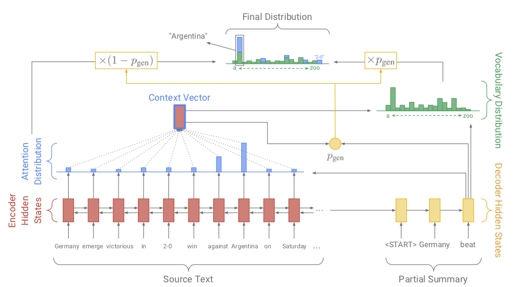
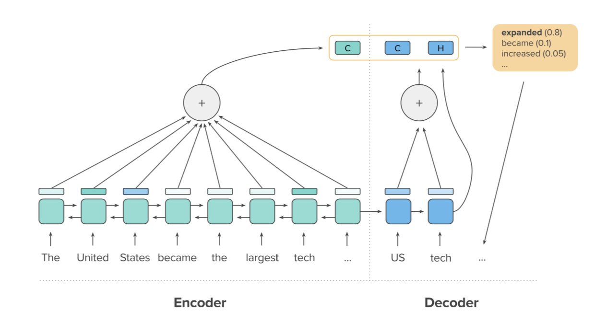
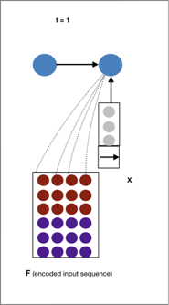
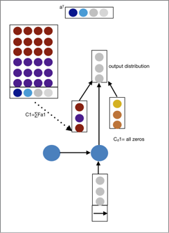
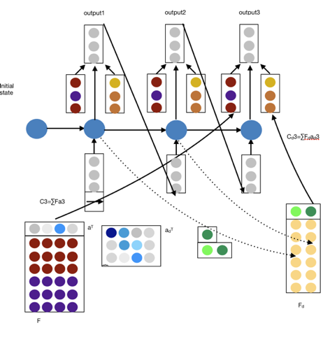

# attention_RNN_for_textsum
This is to reproduce article &lt;A DEEP REINFORCED MODEL FOR ABSTRACTIVE SUMMARIZATION>
## Dataset: CNN_DailyMail ##
### 1.1 General Information: ###
This dataset has nearly 290 articles and 1260K story-question pairs totally: 
	90K of of CNN news and 380K of story-question pairs
	200K new stories and 880K story-question pairs
A news article is usually associated with a few (e.g., 3–5) bullet points, which is story-question, and each of them highlights one aspect of its content. 
The original question format is cloze-style. These questions are actually highlights of news, so the information of question is guaranteed to be included by the given story. In order to use the dataset in text sum task, questions are converted to text summary.

The vocabulary of this dataset is CNN 120K and DM 210K. It is very large vocabulary.

The passages are around 30 sentences and 800 tokens on average, while each question contains around 12–14 tokens. 
It is not very difficulty. Major is paraphrase task.

### 1.2 Dataset Process: ###

Input dataset files format is sequential binary data.
 Step 1: make example queue from input bin file. 
	1. Read the bin file as string to text format.   
	2. Process  input text into example. 
	3. Place the examples into the example queue. (Example queue is a queue having all input samples included.) 

Step2: create batch queue from examples in example queue.
	1. Take the examples out of the example queue.  
	2. Sort them by encoder sequence length
	3. Process it into batches and place them in the batch queue. 

Each time, get next batch from batch queue feed into model. 
## 2. Architecture ##
### 2.1. Pointer ###
For each decoder timestep,  a generation probability pgen ∈ [0, 1] is calculated, which weights the probability of generating words from the vocabulary, versus copying words from the source text. The vocabulary distribution and the attention distribution are weighted and summed to obtain the final distribution, from which we make our prediction. Note that out-of-vocabulary article words such as 2-0 are included in the final distribution. Best viewed in color.(Abigail et al., 2017;<Get To The Point: Summarization with Pointer-Generator Networks>)	

### 2.2.Intra-attention ###
Attention is a key ingredient for machine reading. In this model,  the encoder and decoder attention functions combined. Encoder attention is intra-temporal attention on input sequence. Decoder attention is intra-decoder attention. The two context vectors (marked “C”) are computed from attending over the encoder hidden states and decoder hidden states. Using these two contexts and the current decoder hidden state (“H”), a new word is generated and added to the output sequence.(Romain et al., 2017; <A deep reinforced model for abstractive summarization >)

	
## 3. Forward process ##
We have a matrix F representing  the input, now we need to generate from it.
High-level idea:
Generate the output sentence word by word using RNN.
At each output position t, the RNN receives two inputs
	 A fixed-size vector embedding of the previously generated output symbol
	 A fixed-size vector encoding a “view” of the input matrix
How do we get a fixed-size vector from matrix that changes over time?
	Do a weighted sum of the columns of F based on how important they are at the current time step.(Fat) 
	The weighting of the input column are each time-step(at) is called attention.

### 3.1 T=1, generate encode attention from matrix F. ###

### 3.2  Obtain decoder hidden state from two contexts and input. ###
Encoder and decoder attention distribution is a and ad.  Encoder, decoder context vector is C and Cd.

### 3.3  t=3, generate output3 from decoder hidden state, encoder context and decoder context vector. ###

## 4. Equalizations ##
Put  together the equalizations of attention. 

	
